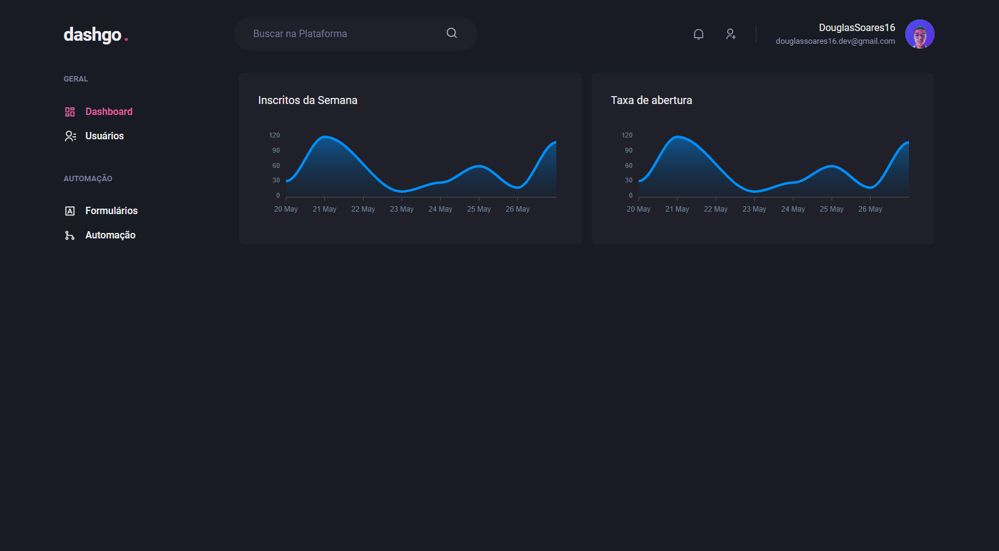

## 💻 Projeto

O projeto 'dashgo' é uma aplicação que funciona como um "Dashboard" onde o usuário poderá fazer algumas ações como listar e criar usuários e analisar alguns gráficos.

  

## 🚀 Tecnologias

Esse projeto foi desenvolvido com as seguintes tecnologias:

* Chakra-UI
* Next.JS
* React-Hook-Form
* React
* TypeScript
* Yup
* Apexcharts
